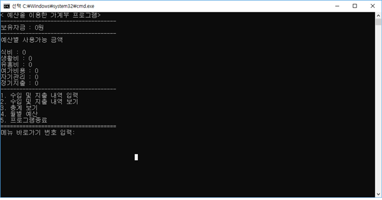

# 18-1_Cpp
[2018-1 전자프로그래밍언어 (C++) Team Project] 예산 관리 가계부 프로그램

## A. 해결할 문제

”어떻게 하면 지금의 지출보다 더 적게 쓸까?“, ”어떻게 하면 더 현명하게 돈을 쓸 수 있을까?“ 요즘 젊은이들을 비롯해 많은 사람들이 이러한 고민을 한다. 지금 보고서를 쓰는 우리도 용돈을 받고 알바를 하면서 제한된 수입 속에서 더 아껴쓰고, 더 현명하게 돈을 쓸 수 있는 방법을 찾아보려 하고 있다. 우리는 서점에서 가계부를 파는 것을 보고 ”가계부를 쓰면 현재 보다 돈을 더 아껴쓰고, 효율적으로 쓸 수 있지 않을까?“라는 생각으로 이번 수업의 프로젝트로 가계부 프로그램을 만들어 보게 되었다.


## B. 간단한 설명 및 주요기능

프로그램을 실행할 때 첫 화면에 직접 결정한 이번 달 사용예산 중, 오늘부터 월 말까지의 사용가능한 금액을 확인할 수 있도록 하는 프로그램입니다.
예산을 설정메뉴에서 예산을 설정하고, 수입내역과 지출내역을 입력할 수 있도록 하며, 수입과 지출을 분류별로 나누어서, 이번 달 동안 어느 곳에 많이 사용했는지 한눈에 알아볼 수 있게 합니다. 또한 첫 화면에 지금부터 월말까지 사용할 수 있는 금액을 상시적으로 확인할 수 있게 하는 프로그램입니다.

### 주요기능 

- 수입 및 지출 기록
- 수입 및 지출 항목에 대한 분류
- 월간 수입 지출 내역 총계 (전체총계, 분류별 총계)
- 사용분류에 따른 예산산정
- 메인화면에 잔액 및 분류별 예산 사용 가능 금액 표시

## C. 프로그램 구조

• 데이터 클래스
  - 날짜, 사용내역, 사용분류, 금액, 수입지출 구분, 사용분류 고정값 변수
  - 링크드리스트 사용을 위한 클래스 포인터 변수

• 데이터 컨트롤(기능) 클래스 – 데이터클래스 상속
  - 링크드 리스트 처음부분
  - 데이터 입력함수
  - 데이터 출력함수
  - 수입, 지출 별 총계 함수
  - 사용 분류별 총계 함수

• 메인 메뉴 클래스 – 데이터 컨트롤 클래스 상속
  - 메인화면 출력
  - 수입 및 지출 입력 함수
  - 수입 및 지출 출력 함수
  - 데이터 총계 함수
  - 예산 보기 및 예산설정 함수
  - text 파일로 데이터 내보내기 함수
  - text 파일에서 데이터 불러오기 함수

• 메인 함수
  - 데이터 불러오기
  - 처음화면 실행
  - 메뉴 선택
  - 데이터 저장(내보내기)

• 추가 기능
  - 콘솔화면 지우기
	```c 
    #include <windows.h>
	system("cls");
    ```
  - 링크드 리스트
  - Data_file.txt 에 저장 및 불러오기


